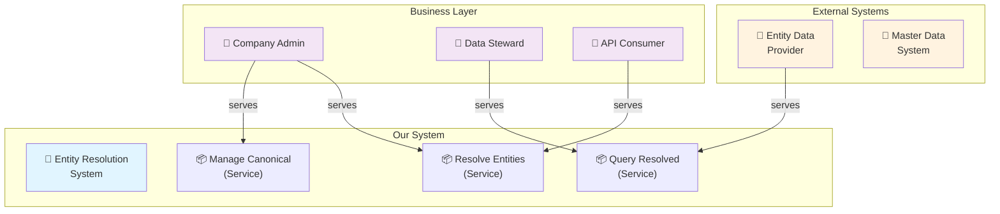
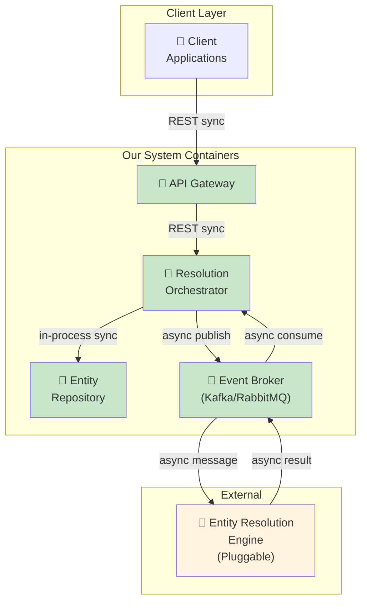
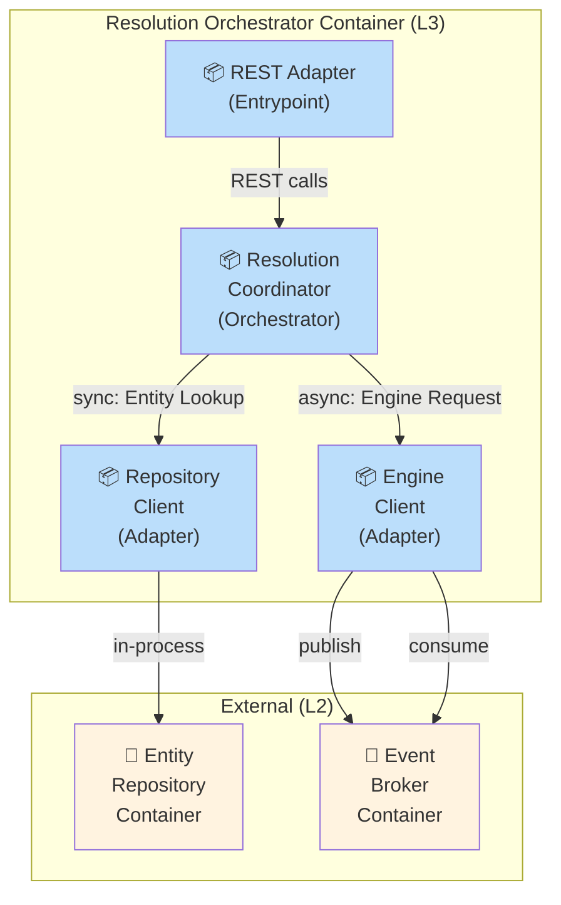
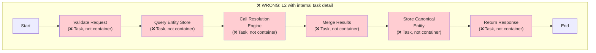
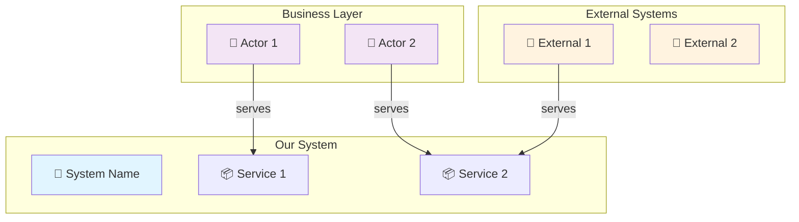
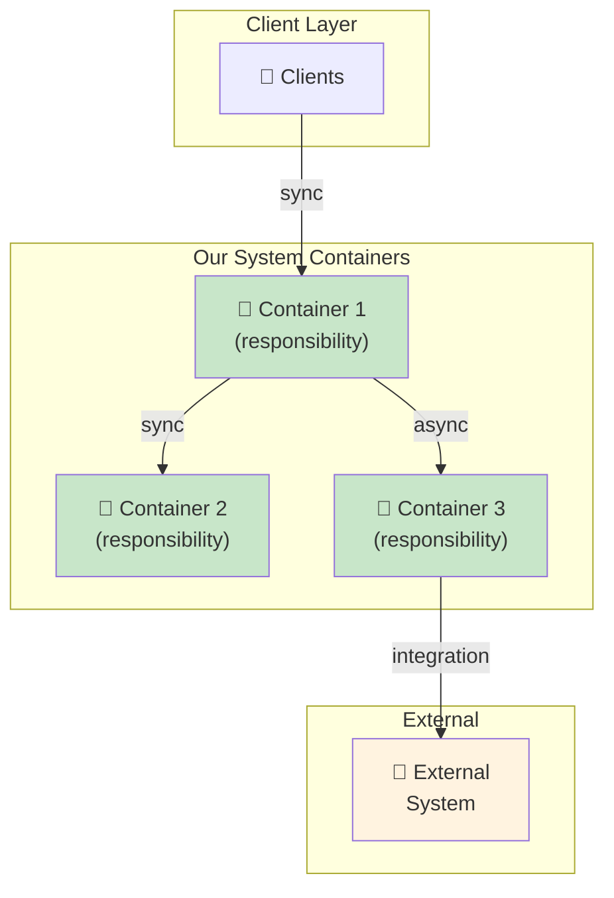
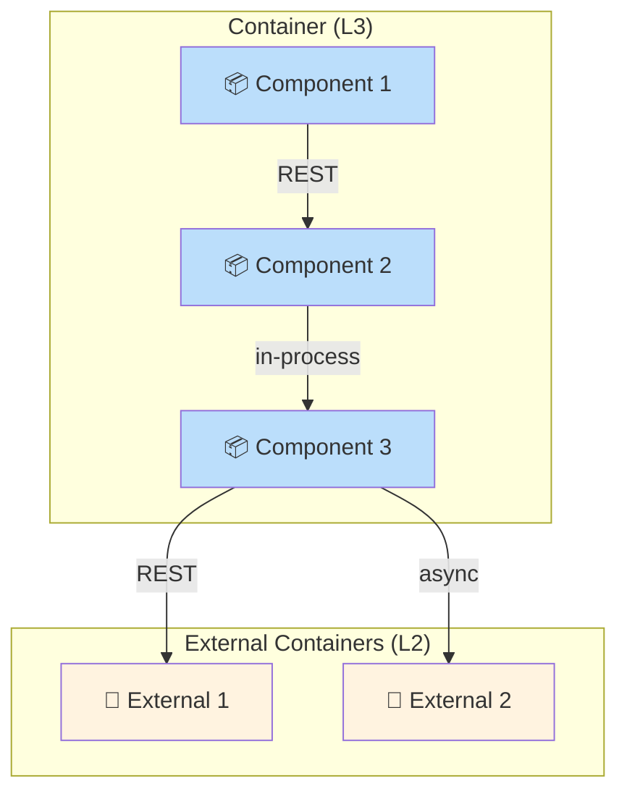

# Architecture Diagram Examples (Mermaid & Text)

Reference examples showing correct diagrams at L1, L2, L3 in Mermaid syntax + descriptive text format.

---

## Example L1: System Context (ArchiMate)

**What this shows**: System boundary, actors, external systems, and external services.

### Mermaid Diagram



### Text Description

```
Business Layer:
  [Company Admin] [Data Steward] [API Consumer]

Application Layer:
  External Systems:
    [Entity Data Provider] [Master Data System]

  Our System:
    [Entity Resolution System]

Services (from Our System):
  - Resolve Entities
  - Query Resolved Entities
  - Manage Canonical Entities

Relationships:
  "Resolve Entities" → serves [Company Admin], [API Consumer]
  "Query Resolved Entities" → serves [Data Steward], [Entity Data Provider]
  "Manage Canonical Entities" → serves [Company Admin]
```

**Key characteristics:**
- Clear boundary around "Our System"
- Business actors (not roles/responsibilities)
- External systems shown
- Services are business capabilities
- No internal structure visible
- No technology details

---

## Example L2: Container View (ArchiMate)

**What this shows**: Runtime deployable units and how they communicate.

### Mermaid Diagram



### Text Description

```
Application Layer Containers:
  [API Gateway] ← incoming requests from clients
  [Resolution Orchestrator] ← orchestrates resolution logic
  [Entity Repository] ← stores canonical entities
  [Event Broker] ← manages async communication
  [Entity Resolution Engine] ← external pluggable engine

Services realised by containers:
  [Resolution Orchestrator] realises "Resolve Entities"
  [Entity Repository] realises "Query Resolved Entities"
  [Entity Repository] realises "Manage Canonical Entities"

Inter-container communication:
  [API Gateway] → [Resolution Orchestrator] (REST - sync)
  [Resolution Orchestrator] → [Entity Repository] (in-process - sync)
  [Resolution Orchestrator] → [Event Broker] (async event publish)
  [Event Broker] → [Entity Resolution Engine] (async message)
  [Event Broker] → [Resolution Orchestrator] (async result consume)
```

**Key characteristics:**
- One container per runtime responsibility
- No orchestration steps visible (that's L3)
- Async communication explicit (via Event Broker)
- Services tie containers to business capabilities
- Interface ownership clear (who publishes, who consumes)
- No database details

---

## Example L3: Component View (UML) - Inside Resolution Orchestrator

**What this shows**: Internal responsibility division within ONE container.

### Mermaid Diagram



### Text Description

```
Internal Components (inside Resolution Orchestrator):
  [REST Adapter] (entrypoint)
    → exposes "Resolve" interface

  [Resolution Coordinator] (orchestrator)
    → consumes "Resolve" from REST Adapter
    → depends on "Entity Lookup" from Repository Client
    → depends on "Engine Request" from Engine Client

  [Repository Client] (adapter to Entity Repository)
    → exposes "Entity Lookup" interface
    → calls Entity Repository via in-process interface

  [Engine Client] (adapter to external engine)
    → exposes "Engine Request" interface
    → publishes to Event Broker
    → consumes from Event Broker

Dependencies (with interaction style):
  REST Adapter ──REST──> Coordinator
  Coordinator ──in-process──> Repository Client
  Coordinator ──async-event──> Engine Client
```

**Key characteristics:**
- All within ONE container (Resolution Orchestrator)
- Each component has one responsibility
- Explicit interfaces between components
- Interaction style labelled (REST, in-process, async)
- No orchestration steps (that's for Sequence diagrams)
- No database or persistence details

---

## Example: ANTI-PATTERN - What NOT to Do (L2)

**Problem: Mixing levels and embedding internal detail**

### Mermaid (showing what's wrong)



### Text Description

```
WRONG - L2 that tries to show internal orchestration:

[API Endpoint]
  ↓
[Validate Request] ← task, not a container!
  ↓
[Query Entity Store]
  ↓
[Call Resolution Engine]
  ↓
[Merge Results]
  ↓
[Store Canonical Entity]
  ↓
[Return Response]
```

**What's wrong:**
- ❌ These are NOT containers (deployable units)
- ❌ These are internal steps/tasks (should be L3 or Sequence diagram)
- ❌ Orchestration logic visible at L2
- ❌ No clear container boundaries
- ❌ Can't tell what's deployable where
- ❌ No services defined
- ❌ No contracts shown

**Correct approach:**
1. **L2 (Containers)**: Show [API Gateway], [Resolution Orchestrator], [Entity Repository]
2. **L3 (Components inside Orchestrator)**: Show [REST Adapter], [Coordinator], [Repository Client], [Engine Client]
3. **Sequence diagram**: Show happy path and failure paths with timing

---

## Comparison: Good vs Anti-Pattern

| Aspect | Good L2 | Anti-Pattern |
|--------|---------|--------------|
| Elements | Containers (deployable units) | Tasks/steps (not deployable) |
| Scope | System boundary to system boundary | Internal workflow steps |
| Relationships | Inter-container communication | Sequential task flow |
| Services | Named business capabilities | Task descriptions |
| Contracts | Interface ownership clear | No explicit contracts |
| Technology | Suppressed or Technology layer | Might sneak in |
| Implementability | Can spec each container independently | Unclear how to implement |

---

## Key Lessons from Examples

1. **Each level answers a different question:**
   - L1: Who uses the system? What does it expose?
   - L2: How does it decompose into deployable units?
   - L3: How is one unit structured internally?

2. **Details belong at their level:**
   - Tasks belong in Sequence or Activity diagrams, not L2
   - Technology belongs in Technology layer, not L1/L2
   - Database details belong in L4 or separate Design doc

3. **Contracts are explicit at L2, L3:**
   - Who provides? Who consumes? (interface ownership)
   - Sync or async? (communication style)
   - What's the boundary? (clear responsibility)

4. **Replaceability requires clear interfaces:**
   - Plug-in capability shown as interface owned by consumer
   - Contract defined separately (OpenAPI, AsyncAPI)
   - No implicit dependencies

5. **Mermaid is great for:**
   - Quick sketches and examples
   - Version control (text-based)
   - Documentation
   - But: Enterprise Architect (Sparks) is the source of truth for formal architecture models

---

## Copy-Paste Templates

### L1 Context Template



### L2 Containers Template



### L3 Components Template


