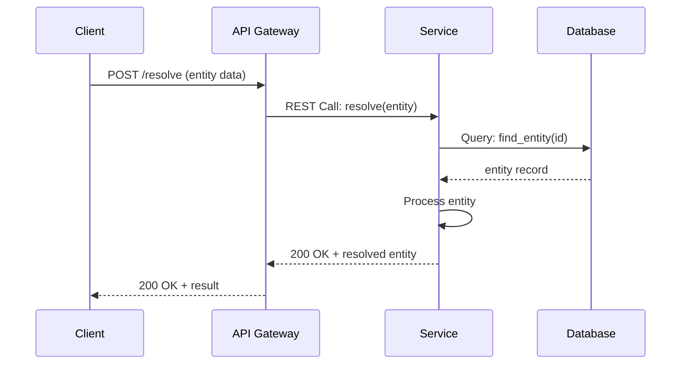
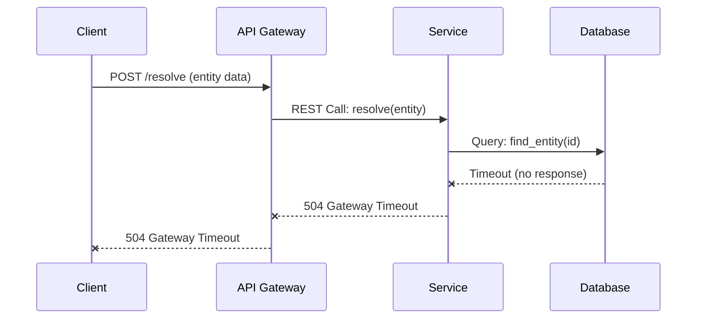
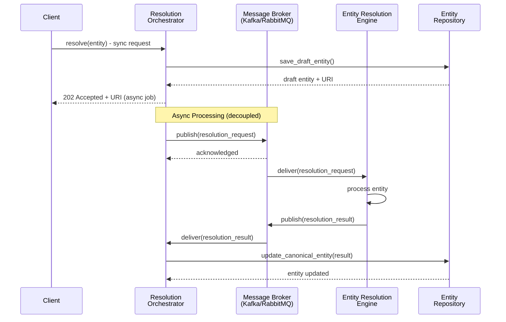
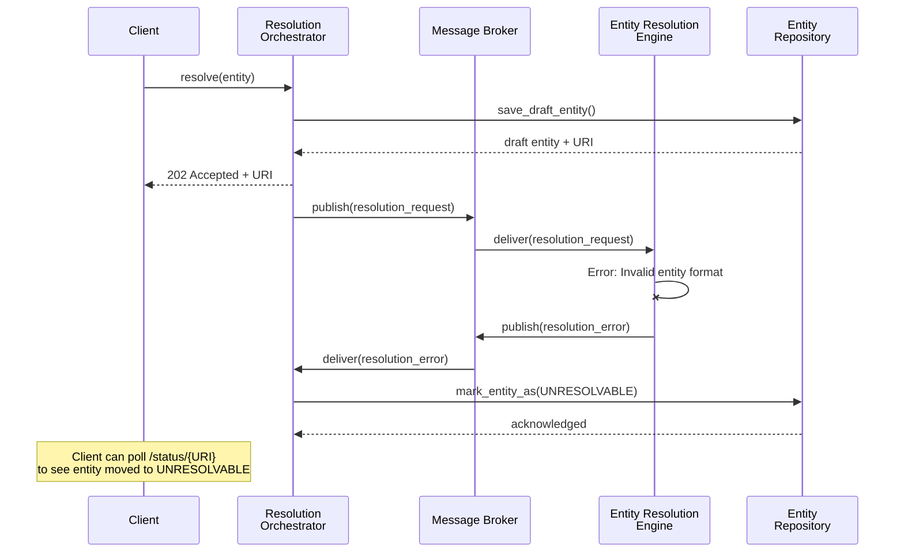
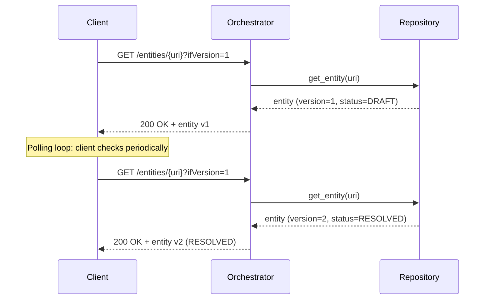
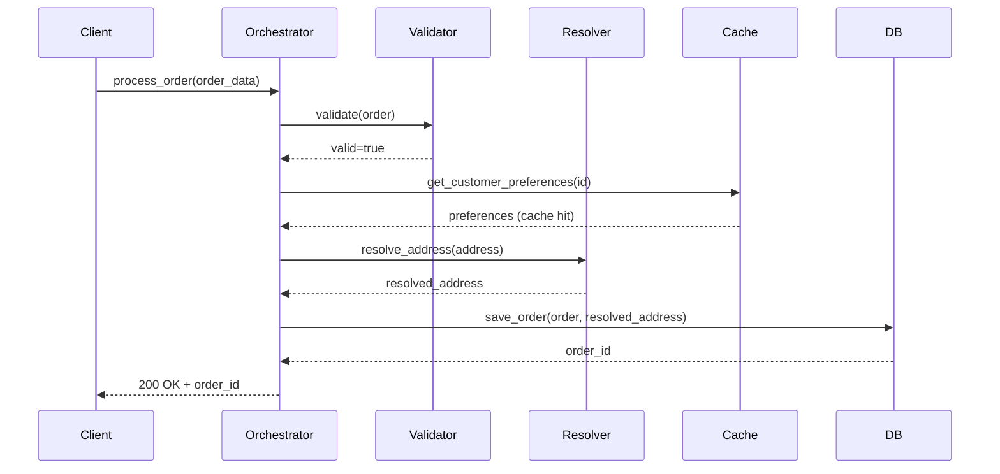
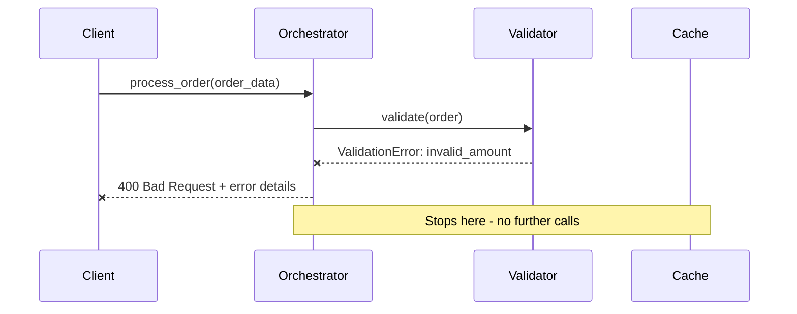
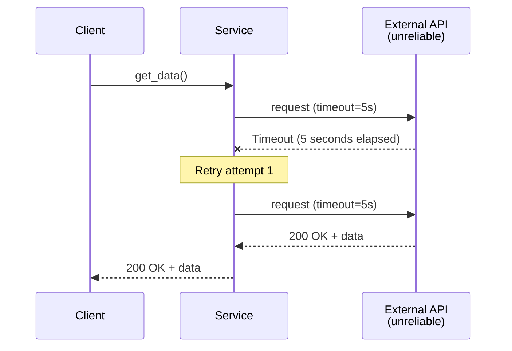
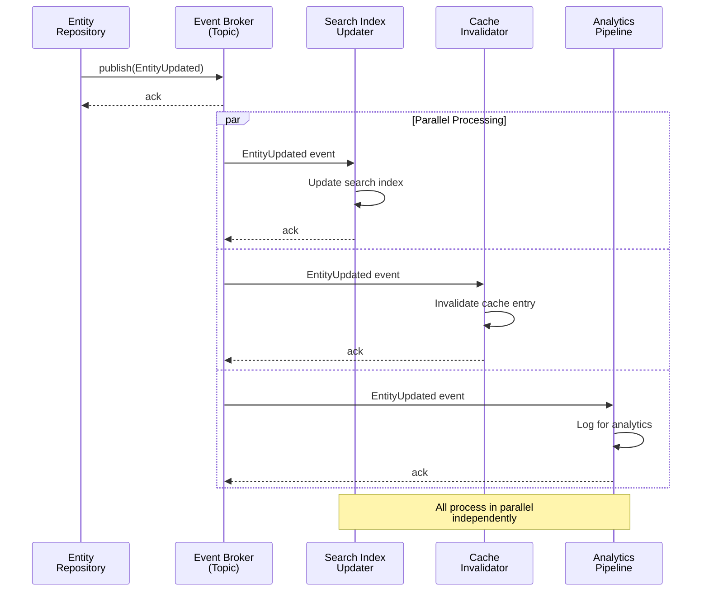
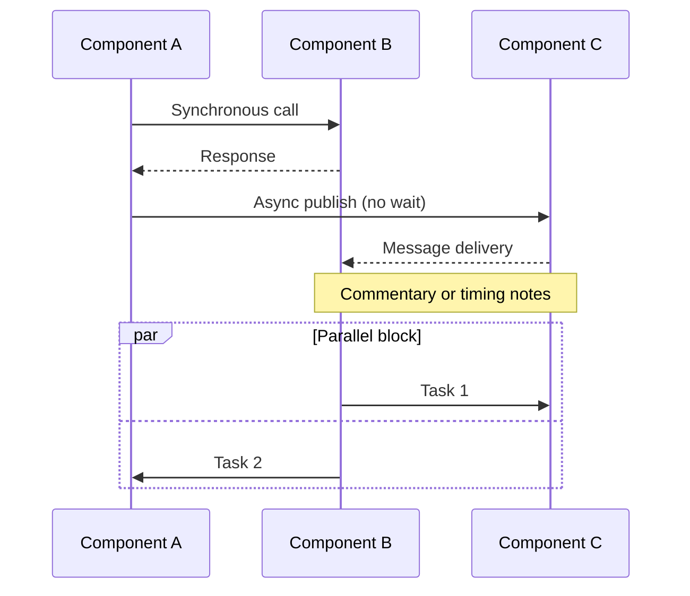

# Sequence Diagram Examples

Real-world sequence diagrams showing interaction patterns, happy paths, and failure paths.

---

## Example 1: Synchronous REST Request-Reply

**Scenario**: Simple synchronous interaction between API Client and REST service.

### Happy Path

**Key points:**
- Synchronous request-reply (arrow `>>` for calls, `-->>` for returns)
- Each step waits for response
- Clear sequence from request to response
- Participant names match components/services

### Failure Path: Timeout

**Key points:**
- Use `--x` to show failed/error returns
- Timeout shown as no response from database
- Error propagates up the chain
- Client sees timeout error

---

## Example 2: Asynchronous Message-Driven Interaction

**Scenario**: Order resolution via async message queue. Publisher doesn't wait for response.

### Happy Path: Async Processing

**Key points:**
- Client gets immediate `202 Accepted` response (not 200)
- Actual processing happens asynchronously after response
- Message broker is **explicit** (shown as participant)
- Each service publishes/consumes independently
- No synchronous waiting

### Failure Path: Processing Error

**Key points:**
- Engine publishes error event
- Orchestrator marks entity as unresolvable
- Client discovers failure via polling (see Step 3 below)
- No exception thrown to client (async = fire-and-forget)

### Client Polling for Results

**Key points:**
- `ifVersion` parameter lets client detect changes
- No need for client to wait or receive push notifications
- Client controls polling frequency
- Stateless queries (can hit any instance)

---

## Example 3: Orchestrator Coordinating Multiple Services

**Scenario**: Complex flow with multiple synchronous dependencies.

### Happy Path: Sequential Calls

**Key points:**
- Orchestrator coordinates sequence
- Cache used for frequently accessed data
- Database write last (after validations)
- Clear linear sequence of operations

### Failure Path: Validation Fails

**Key points:**
- Validation happens FIRST (fail-fast)
- No caching or database operations if validation fails
- Clear error returned to client
- Prevents cascading failures

---

## Example 4: Synchronous with Timeout & Retry

**Scenario**: Resilient pattern with timeout and automatic retry.

**Key points:**
- Timeout set explicitly
- First attempt times out
- Automatic retry (circuit breaker pattern)
- Second attempt succeeds
- Client unaware of internal retries

---

## Example 5: Event-Driven Update Notification

**Scenario**: Service publishes event; multiple subscribers process independently.

**Key points:**
- Event published once
- Multiple independent subscribers
- Parallel processing (not sequential)
- Each consumer processes at its own pace
- Broker coordinates (topics or subscriptions)

---

## Key Patterns to Recognize

### Pattern: Synchronous (Request-Reply)
- Caller blocks waiting for response
- Good for: Immediate feedback needed, strong consistency
- Bad for: High load, cascading failures
- Show with: Solid arrows `>>` and returns `-->>`

### Pattern: Asynchronous (Fire-and-Forget)
- Caller gets immediate ack; actual processing happens later
- Good for: Decoupled systems, high throughput, resilience
- Bad for: Immediate confirmation needed
- Show with: Message broker as explicit participant, separate async flow

### Pattern: Polling for Results
- Client checks for completion periodically
- Good for: Async processing, client controls timing
- Bad for: Frequent updates, low-latency needs
- Show with: Client making repeated GET requests, version/timestamp checks

### Pattern: Callback
- Service calls back when done (not shown here, but similar to event)
- Good for: Async without polling, server-driven updates
- Bad for: Firewall issues, client availability assumptions

---

## Template for Your Sequence Diagrams

**Syntax notes:**
- `A->>B` = call from A to B
- `A-->>B` = return from B to A
- `A-xB` = error/exception
- `Note over X,Y` = comment/annotation
- `par ... and ... end` = parallel blocks

---

## Questions to Ask About Your Sequence Diagram

1. **Is the flow clear?** Can someone read from top to bottom and understand?
2. **Is async explicit?** Is the message broker shown if async?
3. **Are both paths shown?** Happy path AND failure path?
4. **Are timeouts shown?** If synchronous, what happens on timeout?
5. **Who blocks?** Which participants wait for responses?
6. **Who's independent?** Which can happen in parallel?
7. **Is error handling visible?** What happens when something fails?
8. **Do participant names match your L3 components?** (for internal) or L2 containers (for integration)?
